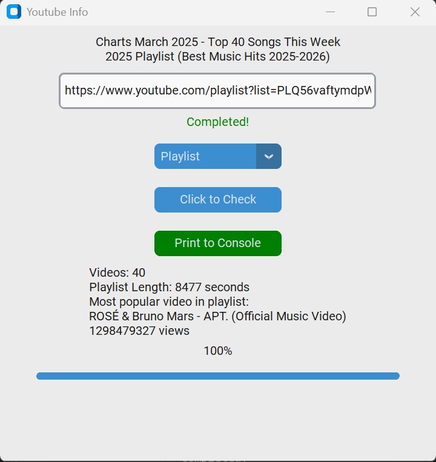

# yt-info-with-python

To practice Python tkinter GUI. 
A simple Python script that is able to get YouTube videos or playlists data.

# WARNING: I DO NOT TAKE ANY RESPONSIBILITY FOR YOUR USAGE OF THIS TOOL! THIS IS FOR EDUCATIONAL PURPOSES ONLY!

## Simple UI demo


## To run
> Prereq: Must have Python installed on local machine
>
> You can visit Official site to download Python: [https://www.python.org/downloads/](https://www.python.org/downloads/)

- Clone repo
    ```bash
    git clone https://github.com/Xiej5645/yt-info-with-python.git
    ```
- Navigate to directory: 
    ```bash
    cd yt-info-with-python
    ```
- Install needed modules
    ```bash
    pip install tkinter customtkinter pytubefix
    ```
- Start and run the application
    ```bash
    python main.py
    ```

<hr/>
